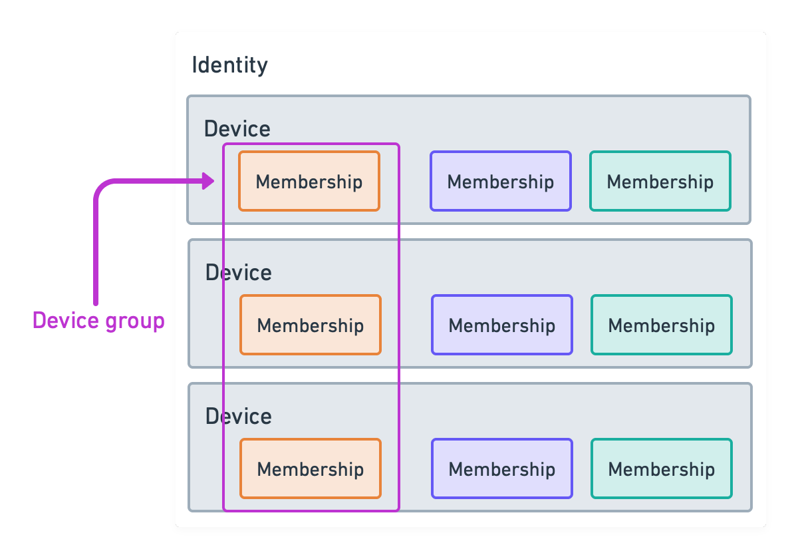

# Slick v1

<!-- TOC -->
- [1. Overview](#1-overview)
  - [1.1. Multiple device support](#11-multiple-device-support)
  - [1.2. Schema-free database](#12-schema-free-database)
- [2. Goals](#2-goals)
  - [2.1. Non-goals](#21-non-goals)
- [3. Encoding](#3-encoding)
- [4. Terminology](#4-terminology)
  - [4.1. Concatenation](#41-concatenation)
- [5. Cryptographic primitives](#5-cryptographic-primitives)
  - [5.1. Password-Authenticated Key Exchange algorithms (PAKEs)](#51-password-authenticated-key-exchange-algorithms-pakes)
  - [5.2. Asymmetric encryption](#52-asymmetric-encryption)
  - [5.3. Symmetric encryption](#53-symmetric-encryption)
  - [5.4. Signing](#54-signing)
  - [5.5. Key Derivation Functions (KDFs)](#55-key-derivation-functions-kdfs)
- [6. Groups](#6-groups)
  - [6.1. Identity](#61-identity)
  - [6.2. Membership](#62-membership)
    - [6.2.1. Membership adding](#621-membership-adding)
    - [6.2.2. Membership removal](#622-membership-removal)
  - [6.3. Intro key](#63-intro-key)
    - [6.3.1. Key rotation](#631-key-rotation)
  - [6.4. Endpoints](#64-endpoints)
    - [6.4.1. ID](#641-id)
    - [6.4.2. HEYA](#642-heya)
  - [6.5. Sessions](#65-sessions)
    - [6.5.1. Jpake handshake](#651-jpake-handshake)
    - [6.5.2. Prekey handshake](#652-prekey-handshake)
- [7. Messaging](#7-messaging)
  - [7.1. Group messages](#71-group-messages)
    - [7.1.1. Group message body](#711-group-message-body)
    - [7.1.2. Private messages](#712-private-messages)
      - [7.1.2.1. Backfills](#7121-backfills)
      - [7.1.2.2. Repair message](#7122-repair-message)
  - [7.2. Acks](#72-acks)
  - [7.3. Lost messages](#73-lost-messages)
    - [7.3.1. Removing users and rejoining](#731-removing-users-and-rejoining)
- [8. Database](#8-database)
  - [8.1. Backfill bodies](#81-backfill-bodies)
- [9. Device group](#9-device-group)
- [10. Security considerations](#10-security-considerations)
  - [10.1. Server](#101-server)
    - [10.1.1. Passive](#1011-passive)
    - [10.1.2. Active](#1012-active)
  - [10.2. Network](#102-network)
  - [10.3. Group member](#103-group-member)
    - [10.3.1. Passive](#1031-passive)
    - [10.3.2. Active](#1032-active)
  - [10.4. MitM](#104-mitm)
  - [10.5. Physical access](#105-physical-access)
  - [10.6. Other considerations](#106-other-considerations)
- [11. Data](#11-data)
  - [11.1. lww string](#111-lww-string)
  - [11.2. lww blob](#112-lww-blob)
  - [11.3. group description](#113-group-description)
  - [11.4. membership](#114-membership)
  - [11.5. membership description](#115-membership-description)
  - [11.6. endpoint info](#116-endpoint-info)
  - [11.7. envelope](#117-envelope)
  - [11.8. encrypted body](#118-encrypted-body)
  - [11.9. endpoint map](#119-endpoint-map)
  - [11.10. jpake pass1](#1110-jpake-pass1)
  - [11.11. jpake pass2](#1111-jpake-pass2)
  - [11.12. jpake pass3](#1112-jpake-pass3)
  - [11.13. jpake pass4](#1113-jpake-pass4)
  - [11.14. jpake pass5](#1114-jpake-pass5)
  - [11.15. jpake pass6](#1115-jpake-pass6)
  - [11.16. jpake inner](#1116-jpake-inner)
  - [11.17. prekey pass1](#1117-prekey-pass1)
  - [11.18. prekey pass2](#1118-prekey-pass2)
  - [11.19. prekey pass3](#1119-prekey-pass3)
  - [11.20. prekey pass4](#1120-prekey-pass4)
  - [11.21. prekey pass5](#1121-prekey-pass5)
  - [11.22. group message](#1122-group-message)
  - [11.23. group message body](#1123-group-message-body)
  - [11.24. application message](#1124-application-message)
  - [11.25. device group application message](#1125-device-group-application-message)
  - [11.26. heya envelope](#1126-heya-envelope)
  - [11.27. heya interior envelope](#1127-heya-interior-envelope)
  - [11.28. ratchet message](#1128-ratchet-message)
  - [11.29. repair message](#1129-repair-message)
  - [11.30. lost message](#1130-lost-message)
  - [11.31. private message](#1131-private-message)
  - [11.32. backfill request](#1132-backfill-request)
  - [11.33. backfill start](#1133-backfill-start)
  - [11.34. group acks](#1134-group-acks)
  - [11.35. ack](#1135-ack)
  - [11.36. backfill](#1136-backfill)
  - [11.37. backfill complete](#1137-backfill-complete)
  - [11.38. backfill abort](#1138-backfill-abort)
  - [11.39. eav operations](#1139-eav-operations)
  - [11.40. value](#1140-value)
  - [11.41. eav backfill](#1141-eav-backfill)
- [12. References](#12-references)
<!-- /TOC -->

## 1. Overview

Slick is a protocol for building offline-first, e2e encrypted applications. This protocol covers how groups are created, support for multiple devices, and an entity-attribute-value (EAV) database that can be used as the basis for applications. This protocol does not have any support for identity management or user discovery, instead offering a simple way for users to form groups by verifying a short password.


### 1.1. Multiple device support

The protocol provides a mechanism for synchronizing group memberships between all devices of a single user. This is accomplished without exposing membership information to the server.

### 1.2. Schema-free database

The protocol includes an entity-attribute-value (EAV) database. The advantage of this type of database is the lack of schema for writes, which allows writes to always succeed. Conflicts are resolved with a last-write-wins strategy.

The protocol also includes a mechanism for backfilling data for new group members, ensuring every member has the same dataset. As well, it provides access levels for values that are sensitive and should only be shared between devices of a single user.

## 2. Goals

1. Confidentiality - messages should employ encryption and messaging should employ perfect forward secrecy
2. Message & transport authenticity - messages should be authenticable by other parties
3. Database consistency - every member should have an eventually consistent view of the data
4. Repudiability - it should not be possible to prove a message originated from a member
5. Private keys stay on device - at no point should it be necessary to transmit a private key to another device

### 2.1. Non-goals

1. Database authenticity - the data within the database cannot be authenticated to the specific author who wrote it, instead, parties must trust each other to honestly relay the data and its' attribution
2. Group access control - any group member can add or remove a member

## 3. Encoding

Data structures referred to in this document are serialized and deserialized using bencode[^bencode]. The bencode-encoded data structures are further described in the [11. Data](#11-data) section of this document which details the specific fields used. This encoding scheme was selected due to efficently handling binary data, as well as it being bijective, that is, for every value there is a single encoding and vice versa.

## 4. Terminology

The key words "MUST", "MUST NOT", "REQUIRED", "SHALL", "SHALL NOT", "SHOULD", "SHOULD NOT", "RECOMMENDED", "MAY", and "OPTIONAL" in this document are to be interpreted as described in RFC 2119.

As well, certain terms used through out this document appear capitalized, and should be understood with the following definitions.

A "GROUP" is a set of IDENTITIES which in turn represent a set of MEMBERSHIPS to that group. Members of a group can send messages to all other members of a group.

A "MEMBERSHIP" is the smallest atom of group membership and represents a user's specific DEVICE.

An "IDENTITY" represents a single user and is a set of MEMBERSHIPS.

A "DEVICE" refers to a piece of hardware capable of running a client and may have multiple MEMBERSHIPS associated with it.

A "DEVICE GROUP" is a special group reserved for only the DEVICES belonging to a single user.

A "SESSION" is a mutual authenticated key-exchange established between two MEMBERSHIPS. A session can employ any number of transports which are described by the ENDPOINTS of each membership.

An "ENDPOINT" is a URL with a priority. A priority specifies an order in which URLs should be used for communication. MEMBERSHIPS may have any number of endpoints.

A "GROUP MESSAGE" is a message intended for all members of a GROUP

A "PRIVATE MESSAGE" is a message intended from one MEMBERSHIP to another MEMBERSHIP using their existing SESSION.

### 4.1. Concatenation

In jpake handshakes, prekey handshakes and signatures, reference to concatenation is made. In all instances, this concatenation MUST be performed by first appending the length of the bytes, encoded as a uint64 little-endian, followed by the actual bytes themselves.

## 5. Cryptographic primitives

The following is a list of cryptographic primitives used by this protocol.

### 5.1. Password-Authenticated Key Exchange algorithms (PAKEs)

- J-PAKE[^jpake] - Authenticates keys used to initiate a SESSION. Specifically, the three-pass variant using Curve25519 is employed.

### 5.2. Asymmetric encryption

- X25519[^secretbox] - Used for double ratchet within a SESSION and during prekey and jpake handshakes and heya envelope encryption.
- TLS v1.3[^tls13] - Used by the local transport for authenticating and encrypting messages.

### 5.3. Symmetric encryption

- ChaCha20-Poly1305[^chacha20] - Used for symmetric encryption within the double ratchet.

### 5.4. Signing

- Ed25519[^Ed25519] - Authenticates keys used to initiate a prekey SESSION.

### 5.5. Key Derivation Functions (KDFs)

- HKDF SHA256[^hkdf] - Used for double ratchet key generation, key confirmation during jpake handshakes and authentication in prekey handshakes.

## 6. Groups



GROUPS are a collection of MEMBERSHIPS which can send messages to each other. Members send messages by fanning messages out to all other members via SESSIONS they have established. GROUPS are identified with a 16-byte identifier. That 16-byte identifier is only used within the context of the DEVICE GROUP which is discussed in [9. Device group](#9-device-group).

GROUPS are described by a [group description](#113-group-description) which enumerates all IDENTITIES and MEMBERS in the group. This data structure is encoded using bencode. Due to bencode being a bijective encoding, a digest of this encoded description can be sent instead of sending the full description when both parties in a SESSION already have the full description. In this manner, when there are changes to the group description, instead of sending a full set of changes, MEMBERSHIPS can send a base digest along with a minimal set of changes in order to describe changes to this description.

Below is a pseudo-group description with dictionary names expanded for clarity.

```
"name":
  "value": "Sample Group"
  "time": 0
"description":
  "value": "Group description"
  "time": 0
"icon":
  "value": ...some bytes...
  "time": 0
"iconType":
  "value": image/png
  "time": 0
"identities":
  "f10e2821bbbea527ea02200352313bc0":
    "c6a10b79929eddd80cf8473f748c04c8":
      "signature":
        5fd924625f6ab16a19cc9807c7c506ae1813490e4ba675f843d5a10e0baacdb8...
      "description":
        "version": 1
        "protocol": 1
        "introKey": 5fd924625f6ab16a19cc9807c7c506ae1813490e4ba675f843d5a10e0baacdb8
        "endpoints":
          "id:sha-256;564cbda476c00aeefed62668f356c2f71a3232a76b99dd0a3c28e8b6a58b4bf7":
            "priority": 0
    "1237abd68d718c8ef8d881823818a8c7":
      "signature":
        914e2c559a542a7313cc6646c28f8cbf8f00f72ce50959528d03c6ac98ec3212...
      "description":
        "version": 1
        "protocol": 1
        "introKey": 10051775c64749acc261077e2f9826fd51f29d35096a1857ea3a6445402123d7
        "endpoints":
          "id:sha-256;8576d84b4be51c67b9f8dea39aa08926bbee588d5a8c82a26abf1d51f05d8176":
            "priority": 0
```

As can be seen, GROUPS are comprised of a number of IDENTITIES which in turn are comprised of a number of MEMBERSHIPS. These MEMBERSHIPS contain any number of ENDPOINTS which can be used to send messages to those specific members.


GROUP membership changes can be made by any member of the group, and changes to the group description are applied according to the following rules:

1. In the case of [lww string](#111-lww-string), the value with the higher time is used. If those times are equal, the lexicographically smaller value is used.
2. In the case of [lww blob](#112-lww-blob), the value with the higher time is used. If both values have equal times, the lexicographically smaller value is used.
3. If an IDENTITY or MEMBERSHIP is not present in the `identities` section, it is added.
4. If a [membership](#114-membership) value has a higher `version`, that value is used.
5. If both [membership](#114-membership) values have equal `version`s, then both memberships are encoded to their bencode-representation and compared. If one value is shorter, the shorter value is used. Otherwise, the lexicographically lower value is used. This is otherwise known as shortlex-order.

This merging strategy has the properties of making changes to the group idempotent and commutative. Thus, all members will converge on a single group description. As well, it always allows for a membership to be removable. This proceedure is detailed in [6.2.2. Membership removal](#622-membership-removal).

All MEMBERSHIPS with a signature MUST be verified when recieved, and any MEMBERSHIP that is not signed should be rejected. The only exception permitted to this is when a MEMBERSHIP has no endpoints, which is permitted with a zero-length signature. The signature in the description corresponds to the 64-byte signature of the following message:

```
|| = concat (prefixed with 4-byte little endian length)
i = identity id of membership
m = membership id of membership
d = [membership description](#115-membership-description) of membership (bencode-encoded representation)

i || m || d
```

When any member receives group description changes, that member MUST apply those changes to their local description and advertise the new description via the mechanism described in [7.1.1. Group message body](#711-group-message-body). Thus, members are added by having an existing member add the new member to their group description, which is then propagated to all other members. Members are initially added by initiating a jpake handshake or being added via the DEVICE GROUP, which is detailed further in [9. Device group](#9-device-group).

Every MEMBERSHIP in the group is responsible for establishing a SESSION with every other member of the group. Any MEMBERSHIPS that have not yet established SESSIONS can still send messages to the GROUP, but must indicate which members they were unable to send to, which is detailed in [7.1. Group messages](#71-group-messages).

### 6.1. Identity

An IDENTITY is a collection of MEMBERSHIPS which represents all the devices a single user is actively using to participate in a GROUP. An IDENTITY is identified by a random 16-byte id. Implementors SHOULD avoid using the first 4-bytes of another IDENTITY id. Failure to do so would result in database writes being misattributed across IDENTITIES.

### 6.2. Membership

A MEMBERSHIP represents a membership of a single device in the user's IDENTITY. A MEMBERSHIP is identified by a 16-byte random id. Implementors SHOULD avoid using the first 3-bytes of another MEMBERSHIP id belonging to the same IDENTITY. Failure to do so would result in database writes being misattributed across memberships within that IDENTITY.

Every membership comprises a _version_, a _protocol_, an _intro key_ and a dictionary of _endpoints_. A _version_ refers to version of the device description. Any MEMBERSHIP wishing to publish a new description increments this field by one. A _protocol_ refers to maximum version number supported by this membership. This field currently can only have the value of `1`. An _intro key_ is a public Ed25519 key that is used to authenticate X25519 ephemeral keys during prekey session handshakes. The dictionary of _endpoints_ is a collection of URLs that can be used to send messages to this membership.

#### 6.2.1. Membership adding

Memberships are either added through jpake handshakes or prekey handshakes. Prekey handshakes are used in the device group proposals method listed under [9. Device group](#9-device-group).

#### 6.2.2. Membership removal

Memberships are removed by modifying the GROUP description to have an empty set of endpoints. As the version number MUST be a uint32, a membership can be permamently removed by setting the version number to its' maximum size, or 4294967295.

### 6.3. Intro key

The intro key is an Ed25519 public key. This key authenticates the ephemeral keys send during the prekey handshake. This key MUST NOT be shared between GROUPs. Failure to do so could result in prekey handshakes being misattributed to the wrong group.

#### 6.3.1. Key rotation

Intro keys can be rotated by adding a new MEMBERSHIP to the GROUP description. Once this description change is received by all members, the old MEMBERSHIP can be deleted by the method noted in [6.2.2. Membership removal](#622-membership-removal).

### 6.4. Endpoints

Every MEMBERSHIP has a dictionary of ENDPOINTS, where the dictionary key represents the URL of the endpoint, and the dictionary value contains the priority of the endpoint. ENDPOINTS are used in priority order, from lowest to highest. If two or more endpoints have equal priority, implementors MUST attempt to send to all the endpoints provided regardless of success.

Endpoints are described with a URL. The scheme of this URL MUST be either "id" or "heya". That scheme indicates which transport is used for sending the message. Transports are expected to handle messages up 1 megabyte in size and implementations SHOULD avoid sending messages larger than that. Transports are also responsible for providing a "from" URL, to allow receivers to indicate who the message is from, however, transports do not need to provide any guarantees as to who the message is from.

As [ratchet message](#1128-ratchet-message)s expose metadata about message counts and order, transports SHOULD attempt to not expose that data to any third parties. Failure to do so would allow third parties to know the frequency of messages sent between two parties.

#### 6.4.1. ID

The `id` scheme used provides a subset of the digest-uri draft[^digesturi] scheme functionality. The following is an example URL as provided under this scheme:

```
id:sha-256;fmVpptgqdvBsLE_qfsO6OxRcguxgtUSQto0L--WlWRI=
```

After the scheme, the digest used is indicated. Currently the only supported digest type is sha-256. This is terminated with a `;` and then a base64-url encoded sha-256 digest of the SSL certificate. Implementors can discover other peers through the use of mDNS.

Peers authenticate each other through mutual TLS v1.3. Only the cipher suite TLS_CHACHA20_POLY1305_SHA256 MUST be used. As messages are sent directly between devices, no further metadata protection is employed.

#### 6.4.2. HEYA

Heya [^heya] provides a store-and-forward messaging service that uses mutual TLS to authenticate clients and servers. It also allows for sending iOS push notifications to allow mobile clients to receive those notifications. Heya URLs also provide a public key for providing metadata protection of any messages sent to it.

```
heya://localhost:10124/svYOX9iIm6tK56yo9S87ZtyK39HgNl3J6wSsjoGCnmk/uLz-SUpV6oijW1UQ4gK3-mUPzs7E1g2nCA39r0-LOqc
```

The heya URL consists of the following parts: scheme, domain name, port (optionally), public key base64-urlsafe encoded, send token base64-urlsafe encoded.

Messages sent to a heya endpoint are encoded in a [heya envelope](#1126-heya-envelope). This envelope contains an encrypted body and an X25519 public key. The body of that envelope is encrypted with ChaCha20-Poly1305 using a zero nonce with the key derived from the DH operation the public key from the heya url and an ephemeral private key generated for that message. Senders of messages MUST NOT reuse an ephemeral public key used in sending. Failure to do so would leak ratchet metadata and handshake data, but not affect the confidentiality or authenticity of that message.

The unencrypted body of a message sent to a heya server is encoded using [heya interior envelope](#1127-heya-interior-envelope). This contains from and body fields. Implementors SHOULD use the from and to URLs present in the group description. Failure to do so will result in messages not being delivered.

### 6.5. Sessions

A SESSION is a bidirectional relationship between two MEMBERSHIPS. SESSIONS begin by establishing a public-private key pair and a symmetric secret which is then used as the inputs to to the double ratchet[^doubleratchet] algorithm. This in turn is used to send encrypted messages between both MEMBERSHIPS.

The key exchange for a session is performed using a jpake handshake or prekey handshake described below. Jpake handshakes are used to add a member to a group who has previously not been part of the group. Prekey handshakes are used to establish sessions between members who already have knowledge of each other, but have not yet established a SESSION.

A SESSION is used to encrypt all messages sent between members using any of the ENDPOINTS specified by each MEMBERSHIP.

Each member of a SESSION maintains a sequence number which is used when sending messages directly between them. As well, each member maintains a record of which messages have been acked by the other member. Each member must also retain the last group description sent by the other party.

In the event of a SESSION already being established between two MEMBERSHIPS, any further attempts to initiate a SESSION SHOULD be ignored. Failure to do would allow the SESSION to be hijacked in the case where a private intro key is lost.

#### 6.5.1. Jpake handshake

Jpake sessions are initiated by sending the [jpake pass1](#1110-jpake-pass1) to your intended recipient out-of-band, that is, through some other communication channel. The secret value being confirmed is `hmac(r, "SECRET")` where `r` is a randomly selected value by p1 and communicated out-of-band.

After the initial sending of [jpake pass1](#1110-jpake-pass1) all further data is transmitted using the endpoints specified by each party in [jpake pass1](#1110-jpake-pass1) and [jpake pass2](#1111-jpake-pass2). The jpake handshake performs explicit key confirmation on pass 5 and pass 6, using `k' = hmac(K, "SLICK_KC")` as the key to confirm where K is the session key. Both parties MUST pick unique ephemeral keys, that is, not reuse any previously used key.

```
^    = dh operation
||   = concat (prefixed with 4-byte little endian length)
hmac = hmac-sha256(key, message)
sym  = ChaCha20-Poly1305(key, nonce, plain)

p1             = party 1
p2             = party 2
e1, e2         = ephemeral keys
e1+pub, e2+pub = corresponding public keys of e1, e2
K              = value specified in J-PAKE rfc
K'             = hmac(K, "SESSION") (session key)
Kc             = hmac(K', "SLICK_KC") (session key confirmation)
k1             = hmac(e1 ^ e2+pub, "JPAKE_CONFIRM_KEY_1")
k2             = hmac(e2 ^ e1+pub, "JPAKE_CONFIRM_KEY_2")

  p1                          p2
           (out of band)
1          [jpake pass1](#1110-jpake-pass1)
      ---> id=16-byte random id
           u1=16-byte user id
           pk1=X25519 public key
           x1g=x1g encoded as bytes
           x2g=x1g encoded as bytes
           x1zkp=zkp body
           x2zkp=zkp body
           r=reply-to map
2          [jpake pass2](#1111-jpake-pass2)
      <--- id=16-byte random id from pass 1
           u2=16-byte user id
           pk2=X25519 public key
           x3g=x3g encoded as bytes
           x4g=x4g encoded as bytes
           xszkp=zkp body
           x3zkp=zkp body
           x4zkp=zkp body
           r=reply-to map
3          [jpake pass3](#1112-jpake-pass3)
      ---> id=16-byte random id from pass 1
           a=a encoded as bytes
           xszkp=zkp body
4          [jpake pass4](#1113-jpake-pass4)
      <--- id=16-byte random id from pass 1
           c=key confirmation hmac(Kc, "KC_1_U" || u1 || u2 || G1 || G2 || G3 || G4)
5          [jpake pass5](#1114-jpake-pass5)
      ---> id=16-byte random id from pass 1
           c=key confirmation hmac(Kc, "KC_1_U" || u2 || u1 || G3 || G4 || G1 || G2)
           i=sym(k1, inner jpake information (inner jpake))
6          [jpake pass6](#1115-jpake-pass6) <---
      <--- id=16-byte random id from pass 1
           i=sym(k2, inner jpake information (inner jpake))
```

The double ratchet uses pk1 as the x25519 key as the asymmetric key and `K'` as the symmetric key.

#### 6.5.2. Prekey handshake

When a GROUP DESCRIPTION contains a membership without an established session, the MEMBER with the lexicographically lower member id begins establishing a session with the other party. If member ids are equal, then the member with the lower identity id is the initiator. A prekey handshake is initiated by sending a [prekey pass1](#1117-prekey-pass1). Implementors SHOULD hold onto unrecognized prekey handshakes for some length of time as prekey handshakes can be sent before the receiver has a new group description to correspond to the initiator of the prekey handshake.

The authentication is based on the SIGMA[^sigma] key authentication scheme. When a prekey1 is initially sent, it has a signature that is used by the other party to attest to the legitamacy of the prekey session request, but is not used for any other purpose. A monotonic nonce is sent by the initiating party to prevent replay attacks. The initiating party maintains a nonce that is unique to both parties. The nonce used by MUST be greater than any previous successfully used nonce. Any prekey1 sent with an older nonce SHOULD be ignored. Both parties MUST pick unique ephemeral keys, that is, not reuse any previously used key.

```
^      = dh operation
||     = concat (prefixed with 4-byte little endian length)
hmac   = hmac-sha256(key, message)
sym    = ChaCha20-Poly1305(key, plain) with zero-nonce
sign   = Ed25519(priv, msg)

p1                             = party 1
p2                             = party 2
id1                            = identity_id1 || membership_id1
id2                            = identity_id2 || membership_id2
s1                             = party 1's private intro key
s2                             = party 2's private intro key
n                              = 16-byte nonce
s                              = hmac(e1 ^ e2+pub, "PREKEY_MAC_KEY")
k1                             = hmac(e1 ^ e2+pub, "PREKEY_CONFIRM_KEY" || id1)
k2                             = hmac(e2 ^ e1+pub, "PREKEY_CONFIRM_KEY" || id2)
e1, e2                         = ephemeral keys
e1+pub, e2+pub                 = corresponding public keys of e1, e2
p1+desc, p2+desc               = the [group description](#113-group-description)s used to initiate the session
                                 from p1 and p2 respectively

  p1                                                               p2

1          [prekey pass1](#1117-prekey-pass1)
     ----> e1+pub
           n
           sig1=sign(s1, n || id1 || id2)
2          [prekey pass2](#1118-prekey-pass2)
     <---- e2+pub
           n
           sig2=sign(s2, hmac(s, n || id2 || e1+pub || e2+pub))
3          [prekey pass3](#1119-prekey-pass3)
     ----> n
           sig3=sign(s1, hmac(s, n || id1 || e2+pub || e1+pub))
4          [prekey pass4](#1120-prekey-pass4)
     <---- n
           d1=sym(k2, p2+desc)
5          [prekey pass5](#1121-prekey-pass5)
     ----> n
           d2=sym(k1, p1+desc)
```

The group description sent MUST be a full copy of the description. This is used as a basis for further merges within that SESSION. Failure to send a full description could lead to an inconsistent state.

To determine which ephemeral key to use as an input to the double ratchet, both ephemeral keys are sorted lexicographically. Then, `hmac(e2 ^ e1+pub, "PREKEY_SELECT_KEY")` is calculated. If the first bit is 0, the first key is used, otherwise, the second key is used. The session key used as an input is `hmac(e2 ^ e1+pub, "PREKEY_SESSION_KEY")`.

## 7. Messaging

All messages sent are encoded using an [envelope](#117-envelope). An envelope can either be of type `jpake2`, `jpake3`, `jpake4`, `jpake5`, `jpake6` (used in the jpake handshake), `prekey1`, `prekey2`, `prekey3`, `prekey4`, `prekey5` (used in the prekey handshake) or a `ratchet message` which is used in GROUP communication. Ratchet messages employ X25519 for asymmetric ratcheting, ChaCha20-Poly1305 with a zero nonce for symmetric encryption and HKDF SHA-256 for symmetric ratcheting.

### 7.1. Group messages

Group messages are messages from a specific MEMBERSHIP to all other members of the GROUP. Group messages use [group message](#1122-group-message) for serialization. Group messages are sent by encrypting it for every member of the group and sending it individually to each member. Group messages can also be sent via the DEVICE GROUP which is detailed in [9. Device group](#9-device-group).

Group messages contain any number of bodies. Group messages also contain metadata relating to the gossip of description changes, along with message acks for the receiver for both group messages and private messages. Group messages also contain any number of private messages and repair messages.

#### 7.1.1. Group message body

Group messages contain any number of group message bodies. These use [group message body](#1123-group-message-body) for serialization. Group messages contain byte sequence which MUST be interpreted as a bencode serialized [application message](#1124-application-message), or if sent to the DEVICE GROUP MUST be interpreted as a [device group application message](#1125-device-group-application-message). The [device group application message](#1125-device-group-application-message) also includes a group id which allows messages to be sent to any GROUP.

The [application message](#1124-application-message) or [device group application message](#1125-device-group-application-message) includes a name field which indicates how the message should be handled. The only valid value for this field is `eav`. These messages pertain to [8. Database](#8-database) as detailed below.

Group messages have a sequence number maintained by the MEMBERSHIP they are sent from and implementors MUST use a monotonically increasing sequence number starting from 1.

Group messages also contain a dictionary of unhandled recipients. The key on this dictionary is the identity id and the value is a lexicographically sorted list of membership ids. If receivers of this message have an established session, they MUST send [repair message](#1129-repair-message)s to all recipients either not included in the group description or listed as unhandled recipients.

#### 7.1.2. Private messages

Private messages are messages that only pertain to a single member of a group. Private messages use [private message](#1131-private-message) for serialization. Private messages also have a sequence number which is maintained by the sender for every other member of a group.

Private messages either pertain to backfills, the sending of existing data so that each member of the group can catch up to previously written messages, or a repair message.

##### 7.1.2.1. Backfills

Backfills allow members to synchornize previously written data. Backfill requests are sent from one member to another as a private message. Backfills can either request only the other member's previous writes (partial) or requesting all writes to the group (full).

The typical flow of a backfill is depicted below:

```
p1         = party 1 (backfill source)
p2         = party 2 (backfill sink)

  p1                          p2

1     <--- backfill request  <---
2     ---> backfill start    --->
3     ---> backfill body     --->
4     ---> backfill body     --->
5     ---> backfill body     --->
6     ---> backfill complete --->
```

Backfill requests have a random 16-byte id which the backfill source uses when responding with either backfill start, backfill body, backfill complete or backfill abort messages. Backfill requests use [backfill request](#1132-backfill-request) for serialization. Backfill sources can also send a [backfill abort](#1138-backfill-abort) message in response to any request, and all further messages pertaining to that backfill SHOULD be ignored.

Backfill start messages use [backfill start](#1133-backfill-start) for serialization. Backfill start messages include the acks from the backfill source from the time the backfill began.

Backfill body messages use [backfill](#1136-backfill) for serialization. Backfill body messages represent the data comprising the backfill itself. The data represented by the body is discussed in further detail under [8.1. Backfill bodies](#81-backfill-bodies). These messages include a `total` field indicating the number of expected backfill body messages expected for this backfill. This field is strictly informational.

Backfill complete messages use [backfill complete](#1137-backfill-complete) for serialization. The backfill complete message includes a `total` number of backfill body messages expected for this backfill. This number is considered authoritative and backfill sinks MUST receive this number of backfill body messages before the backfill is considered complete.

Implementors of this protocol MAY take into account if this backfill is coming from a session belonging to the IDENTITY of the requesting MEMBERSHIP. If it is, it may include data that is only applicable to members within the same IDENTITY. In the case of database detailed in [8. Database](#8-database), keys with a `_self_` prefix MUST be included in the backfill if this is the case.

##### 7.1.2.2. Repair message

Group message bodies that cannot be sent normally are included as private messages. These messages use [repair message](#1129-repair-message).

### 7.2. Acks

Messages are acknowledged by the receiving side. Acks are included in every group message. The format for acks is a number (seq) and series of bytes. The number is inclusive of the last message seq number seen where all messages with a lower seq number have also been seen. The series of bytes is used for "sparse" acks, that is, where a bitmap would best be used to describe which sequence numbers have been seen. Sparse acks being at seq ack + 2, given at least ack + 1 must be missing in order for sparse acks to be necessary. Sparse acks are in lowest to highest order, for example:

```
seq: 128
sparse: 0b11010010         0b11011000
        130, 131 133, 135  137, 138, 140, 141
```

### 7.3. Lost messages

Private or group messages inferred to be unacked based on received acks can be re-included in the group message as a [lost message](#1130-lost-message). Only messages that have not been acked should be included as lost messages.

#### 7.3.1. Removing users and rejoining

Users who have not acked messages recently or have accumulated too many lost messages can be removed from the group. This proceedure is detailed in [6.2.2. Membership removal](#622-membership-removal). Users removed in this fashion can rejoin later by proposing via the DEVICE GROUP if they have other MEMBERSHIPS present in the group, or handshaking again via jpake.

## 8. Database

Application messages labeled with "eav" contain data with an entity-attribute-value model[^eav]. Conflicts are resolved with a last-write-wins strategy. This data is serialized using [eav operations](#1139-eav-operations). The structure of eav operations look approximately like:

```
names:
  ["name", "age", "description"]
map:
1667908394917400: // time in microseconds
  {0x0, 0x5, 0xec, 0xf4, 0x35, 0x3c, 0x75, 0xb6, 0x0, 0x69, 0x49, 0x5b, 0x56, 0xb0, 0x31, 0xca}: // id
    0: // name
      "fido"
    1: // age
      "12"
    2: // description
      "fluffy dog"
```

IDs are 16 bytes. The first 8-bytes encodes the current time in microseconds as a big-endian 64 bit unsigned integer. The next byte is a "version" number. In the case that time values could be potentially re-used due to clock corrections, the version number is incremented to ensure no collisions occur. The next 4 bytes correspond to the first 4 bytes of the IDENTITY id of the writer, and the last 3 bytes correspond to the MEMBERSHIP id of the writer. IDs are then approximately lexicographically ordered as the leading bytes represent time.

```
TTTT TTTT VIII IMMM

T = uint64 time in microseconds (little endian)
V = version
I = identity tag
M = membership tag
```

Names beginning with `_` are reserved. If the name is prefixed with `_self_`, then this indicates these writes are only intended for other members of the user's device group. These changes MUST be sent as [device group application message](#1125-device-group-application-message) messages. If the name is prefixed with `_private_` then this indicates these writes are only intended for the current device. These writes MUST NOT be sent to other members. Any other prefix beginning with `_` is invalid and MUST be ignored.

Values are always encoded as [value](#1140-value), which is a byte sequence that can also represent a null value. Values MUST NOT include data if they are also marked as null. It is recommended that for strings, UTF-8 encoding is used. For floats ascii-encoded values are used.

### 8.1. Backfill bodies

EAV backfills have a special structure. They are serialized using [eav backfill](#1141-eav-backfill). They contain two fields: a list of names and a list of byte sequences. Those byte sequences are packed in the following way:

```
IIII IIII TTTT TTTT NNNN F(V*)

I = id   (big endian uint64)
T = time (big endian uint64)
N = name (big endian uint32, index corresponding to the list of names)
F = flags
V* = value (0 or more bytes)
```

Flags MUST contain a value of 0x1 if value is present. Rows with flags is 0x0 and value is present are invalid. If flags is 0 the value is considered undefined.

## 9. Device group

The DEVICE GROUP is a special group which comprises all the devices belonging to a single user. This group has a reserved id which is the zero value for a 16-byte sequence. Device groups use the [device group application message](#1125-device-group-application-message) to send data.

Devices joining this group SHOULD write their current group memberships with the following names and values:

```
memberships_origin_group_id: the 16-byte group id
memberships_origin_identity_id: the 16-byte identity id
memberships_origin_membership_id: the 16-byte identity id
memberships_membership: the bencode encoded [membership](#114-membership) for this user
```

Failure to write these values could result in group memberships not being synced between devices.

Members of the device group who do not currently have membership in a specific group write a proposal for group membership. It consists of the following values:

```
proposals_applier_identity_id: the 16-byte identity id of the member you wish to apply the change
proposals_applier_membership_id: the 16-byte membership id of the member you wish to apply the change
proposals_applier_group_id: the 16-byte group id this proposal pertains to
proposals_proposed_membership_id: the 16-byte membership id the proposer wishes to be known by
proposals_proposed_membership: the bencode-encoded [membership](#114-membership) the proposer wishes to have applied
```

All members MUST merge the membership with the existing group description. This will cause prekey sessions to be initiated and thus, the other device to join the targeted GROUP.

As well, all devices in the device group MAY write informational data about themselves with the following names and values:

```
devices_name: a string naming the device
devices_type: a string "type" of the device
```

## 10. Security considerations

Below is an analysis of different types of attacks available from the points of view of different actors in the system.

### 10.1. Server

#### 10.1.1. Passive

A server could passively gather IP information of message senders and could infer group membership through a statistical disclosure attack which is exacerbated due to the use of acks. This type of attack could be mitigated by not using servers as intermediaries, or rotating mailboxes on the server, or rotating methods of transport. More work needs to be done to mitigate against this sort of attack, and this document does not provide guidance on mitigating this. [^sar-pr-2018-02]

#### 10.1.2. Active

An actively compromised server could gather not only IP information, but also recipient information, thus making a statistical disclosure attack significantly easier. A compromised server could also prevent delivery of messages or push notifications, or tamper with messages. Tampered messages would fail to decrypt and thus be detectable. Denying delivery would be detectable due to the use of acks, and provided implementors have fallback transports, this type of interference would be repaired. Thus, implementors are encouraged to strike a balance between offering additional transports and bandwidth usage by offering redundant transports to users.

### 10.2. Network

An attacker on the same network as a device could potentially launch a denial of service attack against the local transport. As well, an attacker could launch a denial of service attack against a server involved in sending messages. Implementors should take care to mitigate against these attacks through techniques such as rate limiting and source blocking.

### 10.3. Group member

#### 10.3.1. Passive

A compromised member could break the confidentiality of communications. No mitigation is taken against this aside from preserving the property of refutability. A compromised member would also have access to the social graph of a specific group.

#### 10.3.2. Active

A compromised group member could impersonate anyone in a group for the purposes of writing to the database within a group. A compromised group member could also add or remove other members, thus causing a loss of confidentiality or authenticity to the database. As well, a compromised member could overwrite existing data and thus cause a loss of data. Mitigation against adding and removing members could be offered by implementors by making those changes visible or difficult in some way, e.g. offer the ability to lock groups, or, alter on changes to a group. Mitigation could also be offered by implementation by recording a complete history of EAV writes, thus offering the ability to undo certain writes.

A compromised group member could also engage in a denial of service attack against another member by sending a large number of messages to another user. In the case of undecipherable messages, these messages would delay processing of legitimate messages and could potentially use server resources. In the case of decipherable messages, a compromised member could write messages such that they would consume an ever increasing amount of disk space. Rate limiting on the server would help to mitigate against this threat. As well, rate limiting within the implementation for writes from a single member would help mitigate against writes to disk. A quota system could be implemented as well that would prevent a compromised group member from consuming too many resources.

### 10.4. MitM

A MitM attacker could compromise all communications between two users by intercepting the initial key exchange along with the password used to verify the key exchange. Implementors should mitigate against this by encouraging the use of different communication channels for the initial key and password, thus making this attack much more difficult to carry out.

### 10.5. Physical access

An attacker that gains physical access to a device could compromise either the application or passively read information contained in the database. Implementors should mitigate against this type of attack by encrypting data-at-rest and employing best practices in storing this key. Additionally, implementors could offer the user to supply their password for especially sensitive applications.

### 10.6. Other considerations

Ephemeral keys are used for the prekey handshake, jpake handshake and heya message encryption. In all cases where ephemeral keys are using they MUST NOT be re-used, as this would reveal ciphertexts.

## 11. Data

Data used in this protocol is described in the following fashion:

```
{
  "n": bytes | string | number | OTHER TYPE NAME | { ... } (dict)
}
```

Strings as specified in our encoded are bytes that MUST be encoded using UTF-8. Fields can optionally be prefixed with `[]` to indicate they are lists. Fields can optionally be prefixed with `(len)` to indicate it is of a fixed size. Additional comments are added after `//` to describe the field or other aspects in greater detail.

What follows is a description of all bencode-encoded data structures used in this protocol.

### 11.1. lww string

```
{
  "v": string // value
  "t": uint64 // time in milliseconds
}
```

### 11.2. lww blob

```
{
  "v": bytes  // value
  "t": uint64 // time in milliseconds
}
```

### 11.3. group description

```
{
  "n": [lww string](#111-lww-string),        // name
  "d": [lww string](#111-lww-string),        // description
  "ic": [lww blob](#112-lww-blob),           // icon
  "i": {
    bytes: {                                 // identity_id
      bytes: {                               // membership_id
        "s": bytes(64)[],                    // signature
        "d": [membership](#114-membership)   // description
      }
    }
  }
}
```

### 11.4. membership

```
{
  "s": bytes(64)            // signature
  "d": [membership description](#115-membership-description)
}
```

### 11.5. membership description

```
{
  "v": uint32               // value
  "p": uint32               // protocol
  "ik": bytes(32)           // intro key (Ed25519 public key)
  "es": {                   // endpoints
    string: [endpoint info](#116-endpoint-info) // key is url
  }
}
```

### 11.6. endpoint info

```
{
  "r": number   // time in seconds this endpoint expects to respond
  "p": number   // priority (0-255)
}
```

### 11.7. envelope

```
{
  "t": number // type
  "b": bytes  // body, bencode-encoded representation of indicated type
}

// type can be one of
// RatchetMessage = 0
// Prekey1        = 1
// Prekey2        = 2
// Prekey3        = 3
// Prekey4        = 4
// Prekey5        = 5
// Jpake2         = 6
// Jpake3         = 7
// Jpake4         = 8
// Jpake5         = 9
// Jpake6         = 10
```

### 11.8. encrypted body

```
{
  "k": bytes // public X25519 key
  "b": bytes // body, encrypted,
}
```

### 11.9. endpoint map

```
{
  string: {     // url for endpoint
    "r": number // expected time to response
    "p": number // priority
  }
}
```

### 11.10. jpake pass1

```
{
  "id": bytes(16)       // id used to identify jpake handshake
  "u": bytes(16)        // user id used for jpake
  "k": bytes(32)        // public X25519 key
  "x1g": bytes          // 32-byte encoding, see https://www.rfc-editor.org/rfc/rfc8032.html#section-5.1.2
  "x2g": bytes          // 32-byte encoding, see https://www.rfc-editor.org/rfc/rfc8032.html#section-5.1.2
  "x1zkp": {
    "t": bytes          // 32-byte encoding, see https://www.rfc-editor.org/rfc/rfc8032.html#section-5.1.2
    "r": "bytes         // 32-byte little-endian
    "c": bytes          // 32-byte little-endian
  }
  "x2zkp": {
    "t": bytes          // 32-byte encoding, see https://www.rfc-editor.org/rfc/rfc8032.html#section-5.1.2
    "r": "bytes         // 32-byte little-endian
    "c": bytes          // 32-byte little-endian
  }
  "r": [endpoint map](#119-endpoint-map)   // reply-to endpoints
}
```

### 11.11. jpake pass2

```
{
  "id": bytes(16)       // id used to identify jpake handshake
  "u": bytes(16)        // user id used for jpake
  "k": bytes(32)        // public X25519 key
  "x3g": bytes          // 32-byte encoding, see https://www.rfc-editor.org/rfc/rfc8032.html#section-5.1.2
  "x4g": bytes          // 32-byte encoding, see https://www.rfc-editor.org/rfc/rfc8032.html#section-5.1.2
  "b": bytes            // 32-byte encoding, see https://www.rfc-editor.org/rfc/rfc8032.html#section-5.1.2
  "xszkp": {
    "t": bytes          // 32-byte encoding, see https://www.rfc-editor.org/rfc/rfc8032.html#section-5.1.2
    "r": "bytes         // 32-byte little-endian
    "c": bytes          // 32-byte little-endian
  }
  "x3zkp": {
    "t": bytes          // 32-byte encoding, see https://www.rfc-editor.org/rfc/rfc8032.html#section-5.1.2
    "r": "bytes         // 32-byte little-endian
    "c": bytes          // 32-byte little-endian
  }
  "x4zkp": {
    "t": bytes          // 32-byte encoding, see https://www.rfc-editor.org/rfc/rfc8032.html#section-5.1.2
    "r": "bytes         // 32-byte little-endian
    "c": bytes          // 32-byte little-endian
  }
  "r": [endpoint map](#119-endpoint-map) // reply-to endpoints
}
```

### 11.12. jpake pass3

```
{
  "id": bytes(16)       // id used to identify jpake handshake
  "a": bytes            // 32-byte encoding, see https://www.rfc-editor.org/rfc/rfc8032.html#section-5.1.2
  "xszkp": {
    "t": bytes          // 32-byte encoding, see https://www.rfc-editor.org/rfc/rfc8032.html#section-5.1.2
    "r": "bytes         // 32-byte little-endian
    "c": bytes          // 32-byte little-endian
  }
}
```

### 11.13. jpake pass4

```
{
  "id": bytes(16)       // id used to identify jpake handshake
  "c": bytes            // key confirmation
}
```

### 11.14. jpake pass5

```
{
  "id": bytes(16)       // id used to identify jpake handshake
  "c": bytes            // key confirmation
  "i": bytes            // encrypted [jpake inner](#1116-jpake-inner) bencode-encoded
}
```

### 11.15. jpake pass6

```
{
  "id": bytes(16)       // id used to identify jpake handshake
  "i": bytes            // encrypted [jpake inner](#1116-jpake-inner) bencode-encoded
}
```

### 11.16. jpake inner

```
{
  "s": bytes(64)                                   // Ed25519 signature of identity_id || membership_id || desc
  "i": bytes(16)                                   // identity id
  "m": bytes(16)                                   // membership id
  "d": [group description](#113-group-description) // description of group
}
```

### 11.17. prekey pass1

```
{
  "k": bytes(32) // ephemeral public key
  "n": bytes(16) // nonce
  "s": bytes(64) // signature 1
}
```

### 11.18. prekey pass2

```
{
  "k": bytes(32) // ephemeral public key
  "n": bytes(16) // nonce
  "s": bytes(64) // signature 2
}
```

### 11.19. prekey pass3

```
{
  "n": bytes(16) // nonce
  "s": bytes(64) // signature 3
}
```

### 11.20. prekey pass4

```
{
  "n": bytes(16) // nonce
  "d": bytes     // encrypted [group description](#113-group-description) bencode-encoded
}
```

### 11.21. prekey pass5

```
{
  "n": bytes(16) // nonce
  "d": bytes     // encrypted [group description](#113-group-description) bencode-encoded
}
```

### 11.22. group message

```
{
  "b": [group message body](#1123-group-message-body)
  "gs": number                // group ack seq
  "gss": bytes                // group ack sparse
  "ps": number                // private ack seq
  "pss": bytes                // private ack sparse
  "bd": bytes                 // base digest
  "gc": bytes                 // group changes, bencode-encoded [group description](#113-group-description)
  "gcs": bytes                // if there are group changes present, this is a signature for the bytes in "gc"
  "nd": bytes                 // new digest, if would be the same as "bd", send zero-length blob
  "m": [private message](#1131-private-message)    // private messages
  "l": [lost message](#1130-lost-message)       // lost messages
}
```

### 11.23. group message body

```
{
  "b": bytes  // body
  "s": number // seq
  "u": {      // unhandled recipients
    bytes(16): bytes(16)[] // key is identity id, value is sorted membership ids
  }
}
```

### 11.24. application message

```
{
  "n": string // name
  "b": bytes  // body
}
```

### 11.25. device group application message

```
{
  "i": bytes // group id
  "n": string // name
  "b": bytes  // body
}
```

### 11.26. heya envelope

```
{
  "pk": bytes(32) // public key
  "b": bytes      // body
}
```

### 11.27. heya interior envelope

```
{
  "f": string // from
  "b": bytes  // body
}
```

### 11.28. ratchet message

```
{
  "dh": bytes
  "n": number
  "pn": number
  "b": bytes // body
}
```

### 11.29. repair message

```
{
  "i": bytes // identity id
  "m": bytes // membership id
  "s": number // sequence number
  "b": bytes // body
}
```

### 11.30. lost message

```
{
  "t": number // type
  "b": bytes  // body
}

// type can be one of
//  0 (private)
//  1 (group)
```

### 11.31. private message

```
{
  "t": number // type
  "b": bytes // body, encoded according to type
  "s": number // sequence
}

// type can be one of
//  0 (request)
//  1 (start)
//  2 (body)
//  3 (complete)
//  4 (abort)
//  5 (repair message)
```

### 11.32. backfill request

```
{
  "i": bytes(32) // id
  "t": number // type
}

// type can be one of
//  0 (full)
//  1 (partial)
```

### 11.33. backfill start

```
{
  "i": bytes(32) // id
  "a": [group acks](#1134-group-acks)
}
```

### 11.34. group acks

```
{
  "a": {
    bytes: { // identity id
      bytes: [ack](#1135-ack) // key is membership id
    }
  }
}
```

### 11.35. ack

```
{
  "s": number // sequence number
  "sp": bytes // sparse
}
```

### 11.36. backfill

```
{
  "i": bytes  // id
  "t": number // total
  "b": bytes  // body
}
```

### 11.37. backfill complete

```
{
  "i": bytes // id
  "t": number // total
}
```

### 11.38. backfill abort

```
{
  "i": bytes // id
}
```

### 11.39. eav operations

```
{
  "n": string[] // names
  "m": {
    number: { // time in microseconds
      bytes(16): { // id
        number: [value](#1140-value) // key is index in names
      }
    }
  }
}
```

### 11.40. value

```
{
  "p": number // present, either 0 or 1
  "b": bytes // value body
}
```

### 11.41. eav backfill

```
{
  "n": string[] // names
  "d": byte[][] // data
}
```

## 12. References

[^bencode]: https://en.wikipedia.org/wiki/Bencode
[^jpake]: https://www.rfc-editor.org/rfc/rfc8236.html
[^secretbox]: https://nacl.cr.yp.to/secretbox.html
[^sigma]: https://www.iacr.org/cryptodb/archive/2003/CRYPTO/1495/1495.pdf
[^doubleratchet]: https://signal.org/docs/specifications/doubleratchet/doubleratchet.pdf
[^heya]: https://github.com/meow-io/heya
[^tls13]: https://www.rfc-editor.org/rfc/rfc8446
[^digesturi]: https://datatracker.ietf.org/doc/html/draft-hallambaker-digesturi-02
[^eav]: https://en.wikipedia.org/wiki/Entity%E2%80%93attribute%E2%80%93value_model
[^sar-pr-2018-02]: https://sar.informatik.hu-berlin.de/research/publications/SAR-PR-2018-02/SAR-PR-2018-02_.pdf
[^chacha20]: https://datatracker.ietf.org/doc/html/rfc7539
[^Ed25519]: https://Ed25519.cr.yp.to/
[^hkdf]: https://www.rfc-editor.org/rfc/rfc5869
